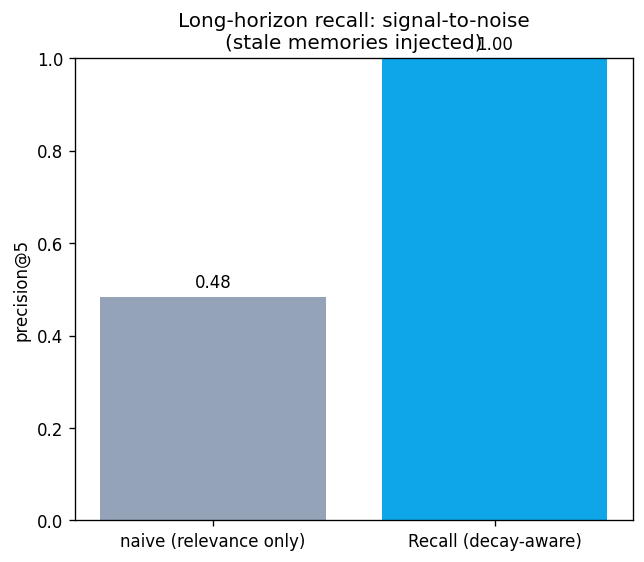
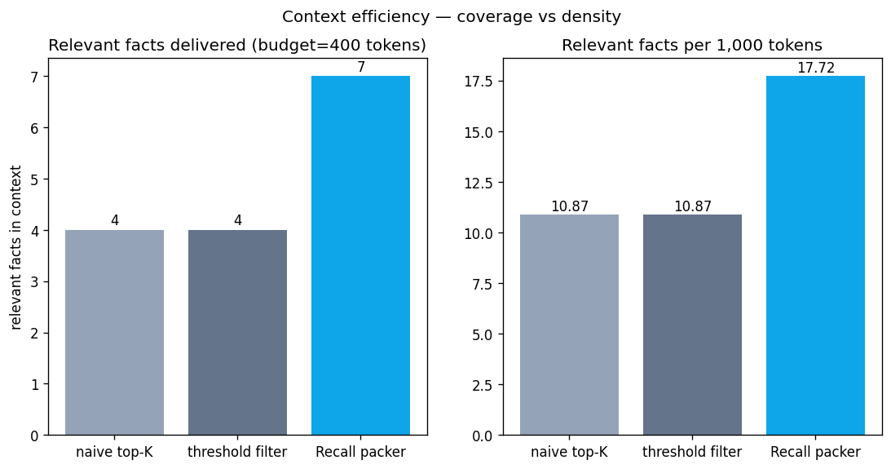
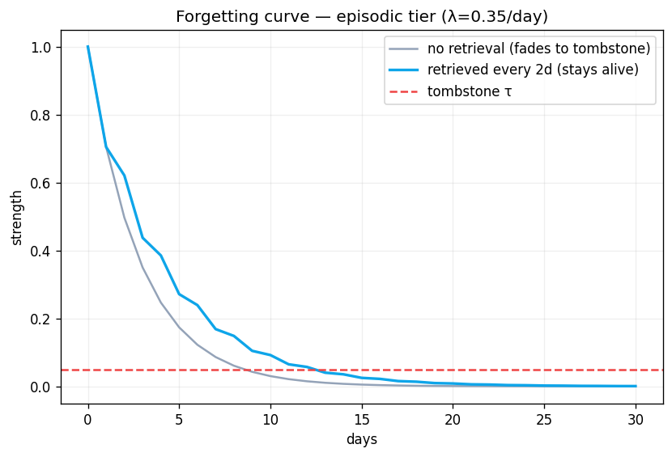

# Benchmarks

Deterministic, offline benchmarks that exercise the real engine math against
synthetic data. Run them all:

```bash
pip install -e ".[bench]"
python -m benchmarks.run_all     # writes charts + summary.json to benchmarks/output/
```

## Headline results

| Benchmark | Metric | Baseline | Recall |
|---|---|---|---|
| Long-horizon recall (`recall_snr`) | precision@5 with injected stale memories | 0.48 (relevance only) | **1.00** (decay-aware) |
| Context efficiency (`context_efficiency`) | relevant facts in a 400-token budget | 4 (naive/threshold) | **7** (budget-packer) |
| Forgetting curve (`forgetting_curve`) | mean strength, retrieved vs untouched | 0.11 | **0.14** (1.33× via reinforcement) |





## Notes
- Numbers are reproducible (fixed seeds) and computed with the same `recall.core`
  functions used in production (`decay`, `retrieval.score_candidates`,
  `retrieval.pack_to_budget`).
- The honest reading: the relevance-threshold filter wins on *density* (facts per
  token) but loses on *coverage* — it drops facts. The packer maximizes coverage
  within the budget, which is what an agent's context window actually needs.
- Additional engine-level benchmarks (conflict auto-resolution accuracy,
  confidence calibration / ECE, prefetch hit-rate) run as integration tests
  against live datastores.
